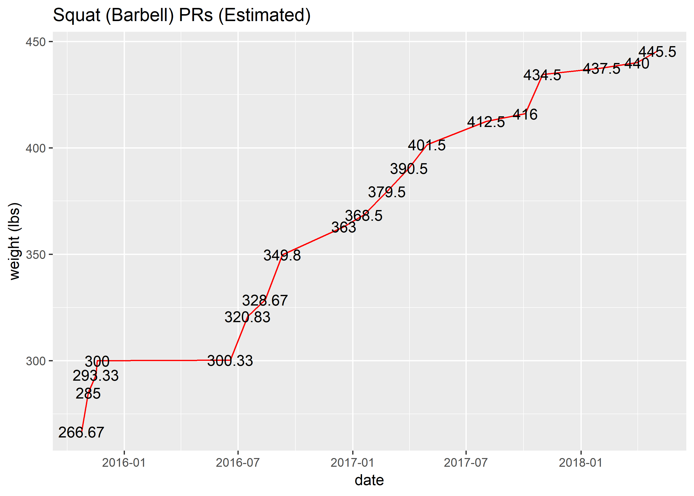

Lifting
================
Chris Oh
2019-05-25

-   [Motivation](#motivation)
-   [PR tracker](#pr-tracker)
    -   [Actual PRs](#actual-prs)
    -   [Estimated One-rep Maxes](#estimated-one-rep-maxes)
-   [Volume Tracker](#volume-tracker)
    -   [Big three volume](#big-three-volume)
    -   [Estimated 1RM vs. Volume](#estimated-1rm-vs.-volume)

``` r
# Libraries
library(tidyverse)
library(lubridate)
```

Motivation
----------

``` r
lift <- 
  read_csv(path_lift) %>% 
  rename_all(
    funs(
      str_to_lower(.) %>% 
      str_replace_all(., " ", "_")
      )
    )
```

    ## Parsed with column specification:
    ## cols(
    ##   Date = col_datetime(format = ""),
    ##   `Workout Name` = col_character(),
    ##   `Exercise Name` = col_character(),
    ##   `Set Order` = col_double(),
    ##   Weight = col_double(),
    ##   Reps = col_double(),
    ##   Distance = col_double(),
    ##   Seconds = col_double(),
    ##   Notes = col_character(),
    ##   `Workout Notes` = col_character()
    ## )

``` r
lift %>% glimpse()
```

    ## Observations: 12,593
    ## Variables: 10
    ## $ date          <dttm> 2015-10-10 14:55:01, 2015-10-10 14:55:01, 2015-...
    ## $ workout_name  <chr> "Intermediate S", "Intermediate S", "Intermediat...
    ## $ exercise_name <chr> "Squat (Barbell)", "Squat (Barbell)", "Squat (Ba...
    ## $ set_order     <dbl> 1, 2, 3, 4, 5, 6, 1, 2, 3, 4, 1, 2, 3, 4, 1, 2, ...
    ## $ weight        <dbl> 240, 240, 240, 240, 240, 240, 205, 205, 205, 205...
    ## $ reps          <dbl> 2, 2, 2, 2, 2, 2, 5, 5, 5, 5, 8, 8, 8, 8, 9, 9, ...
    ## $ distance      <dbl> 0, 0, 0, 0, 0, 0, 0, 0, 0, 0, 0, 0, 0, 0, 0, 0, ...
    ## $ seconds       <dbl> 0, 0, 0, 0, 0, 0, 0, 0, 0, 0, 0, 0, 0, 0, 0, 0, ...
    ## $ notes         <chr> "Grip with pinky on the smooth part", NA, NA, NA...
    ## $ workout_notes <chr> NA, NA, NA, NA, NA, NA, NA, NA, NA, NA, NA, NA, ...

PR tracker
----------

### Actual PRs

As a powerlifter, I am most interested in increasing the loads lifted in the "big three" - squat, bench press, and deadlift.

Here, I am tracking the cumulative heaviest weights in each of the lifts over time.

``` r
big_three <- c("Squat (Barbell)", "Bench Press (Barbell)", "Deadlift (Barbell)")

pr_tracker <- function(exercise) {
  lift %>% 
  filter(
    exercise_name %in% exercise,
    !is.na(weight),
    reps > 0
  ) %>%
  group_by(date) %>% 
  top_n(1, weight) %>%
  top_n(1, set_order) %>% 
  ungroup() %>% 
  mutate(
    pr = cummax(weight)
  ) %>% 
  filter(pr > lag(pr)) %>% 
  ggplot(aes(date, weight)) + 
  geom_line(color = "red") +
  geom_text(aes(label = weight)) +
  labs(
    title = str_c(exercise, " PRs (Actual)"),
    y = "weight (lbs)"
  )
}

big_three %>% 
  walk(~print(pr_tracker(exercise = .)))
```


From mid-2016 to mid-2017, there was a relatively rapid progression in all three lifts. In the last year or so, it has slowed down significantly.

As of December of 2018, this puts my gym total at 1290lbs.

### Estimated One-rep Maxes

One problem with just tracking the heaviest sets recorded is that it does not take into account the number of reps.

Luckily, there are formulas available to correlate the sets with multiple repetitions to an estimated one-rep max (1RM) strength.

From experience, I know that the Epley formula (Epley, B. (1985). Poundage Chart. Boyd Epley Workout. Lincoln, NE: Body Enterprises.)

, \:reps > 1")

usually does a good job for myself.

The formulas do not work as well with high-rep sets (as a rule of thumb, reps at or greater than 10), so these were excluded from the calculation of the estimated 1RMs.

``` r
erm_tracker <- function(exercise) {
  lift %>% 
  filter(
    exercise_name %in% exercise,
    !is.na(weight),
    reps > 0,
    reps < 10
  ) %>%
  mutate(erm = ifelse(reps > 1, weight * (1 + reps / 30), weight)) %>% 
  group_by(date) %>% 
  top_n(1, erm) %>%
  top_n(1, set_order) %>% 
  ungroup() %>% 
  mutate(
    pr = cummax(erm)
  ) %>% 
  filter(pr > lag(pr)) %>% 
  ggplot(aes(date, erm)) + 
  geom_line(color = "red") +
  geom_text(aes(label = erm %>% round(2))) +
  labs(
    title = str_c(exercise, " PRs (Estimated)"),
    y = "weight (lbs)"
  )
}

big_three %>% 
  walk(~print(erm_tracker(exercise = .)))
```



As suspected, the progression we can see here is smoother, but still with a noticeable slow down in the last year or so.

This puts me at a 1323.83lbs all-time best estimated 1RM total, but this is likely an over-estimation of my current ability.

Volume Tracker
--------------

Plenty of literature and anecdotal evidence suggest that volume (weight x reps x sets) accumulation is key to driving maximal 1RM strength.

Here, I attempt to explore how the volume correlates with top-end strength (estimated 1RMs) in my own training.

This is a bit tricky to accomplish, as many exercises overlap in terms of the muscles used, thereby creating carryovers.

e.g. It would be wrong to attribute progression in the squat estimated 1RM to just the volume in squats. Deadlifts, leg presses, even planks might have all contributed to the increase in squat strength in varying degrees.

Nonetheless, the following charts will give me a rough overview of my training effectiveness and a glimpse into improvements I could make moving forward.

### Big three volume

Granularity should be considered when tracking volume.

For the majority of the time, the structure of the training programs used were designed such that heavier PR attempts were made at the end of a four-week training cycle.

Therefore, four-week chunks that line up with each training cycle would make the most sense for tracking the total volume.

However, doing so is complicated by fluctuations in schedule (deload weeks, off-program lifts, etc).

In the end, I decided to go with just a monthly accumulated volume in each lift as the best measure.

``` r
volume_tracker <- function(exercise) {
  lift %>% 
  filter(
    exercise_name %in% exercise,
    !is.na(weight),
    reps > 0
  ) %>%
  mutate(
    volume = weight * reps,
    month = floor_date(date, "month")
  ) %>%  
  group_by(month) %>% 
  summarize(total_vol = sum(volume)) %>% 
  ggplot(aes(month, total_vol)) + 
  geom_point(color = "red") +
  labs(
    title = str_c(exercise, " monthly total volume (weight x reps x sets)"),
    y = "weight (lbs)"
  )
}

big_three %>% 
walk(~print(volume_tracker(exercise = .)))
```


There is a general upward trend in the monthly volume in all lifts, except for the significant dip in mid-2018 when I made a switch to a different program.

All the times the bench press volume took a hit, I had sustained an injury (including towards the end of 2018).

No wonder the progress on this lift has not been as consistent as the other two.

Over time, the volume is expected to climb up.

### Estimated 1RM vs. Volume

Now, let's see how the two variables correlate.

``` r
pr_volume <- function(exercise) {
  lift %>% 
  filter(
    exercise_name %in% exercise,
    !is.na(weight),
    reps > 0
  ) %>%
  mutate(
    volume = weight * reps,
    month = floor_date(date, "month")
  ) %>%  
  group_by(month) %>% 
  mutate(total_vol = sum(volume)) %>% 
  filter(
    reps > 0,
    reps < 10
  ) %>%
  mutate(erm = ifelse(reps > 1, weight * (1 + reps / 30), weight)) %>% 
  group_by(date) %>% 
  top_n(1, erm) %>%
  top_n(1, set_order) %>% 
  ungroup() %>% 
  mutate(
    pr = cummax(erm)
  ) %>% 
  group_by(month) %>% 
  arrange(month) %>% 
  slice(1) %>% 
  ungroup() %>% 
  ggplot(aes(total_vol, pr)) + 
  geom_point(color = "red") +
  geom_smooth(method = "loess") +
  labs(
    title = str_c(exercise, " Estimated 1RM vs. Monthly Volume"),
    y = "weight (lbs)"
  )
}

big_three %>% 
  walk(~print(pr_volume(exercise = .)))
```


As suspected, there is a case to be made of volume being one of the primary drivers of maximal strength output as evidenced by the positive correlation between the two variables.

The points in the upper left corners are cases in which a significant deload had been taken (dropping volume, and thereby the fatigue on the body) before attempting heavy weights.
